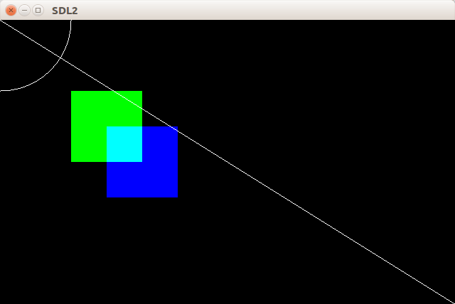

# 创建并使用Renderer  
渲染器(Renderer)是绘图的工具，类似于画笔，使用[`SDL_CreateRenderer`](http://wiki.libsdl.org/SDL_CreateRenderer)函数来创建Renderer，它的参数依次是所属的窗口、在该窗口中的索引和Renderer的[属性](http://wiki.libsdl.org/SDL_RendererFlags)。可以将index设为-1自动分配索引。  

```C
#include <SDL_render.h>
SDL_Renderer* SDL_CreateRenderer(SDL_Window* window,int index,Uint32 flag);
//成功返回Renderer的指针，否则返回NULL
```  

创建了Renderer之后就用来在窗口上画图了，通常首先应该先用[`SDL_RenderClear`](http://wiki.libsdl.org/SDL_RenderClear)函数清空窗口。  

```C
#include <SDL_render.h>
int SDL_RenderClear(SDL_Renderer* renderer);
//成功返回0，失败返回负值
```

使用[`SDL_SetRenderDrawColor`](http://wiki.libsdl.org/SDL_SetRenderDrawColor)函数可以设置绘图的颜色，它的参数依次是SDL_Renderer指针、RGBA颜色的红色分量(Red)、绿色分量(Green)、蓝色分量(Blue)和Alpha分量。  

```C
#include <SDL_render.h>
int SDL_SetRenderDrawColor(SDL_Renderer* renderer,
                            Uint8 r,Uint8 g Uint8 b,Uint8 a);
//成功返回0，失败返回负值
```  

[SDL_SetRenderDrawBlendMode](http://wiki.libsdl.org/SDL_SetRenderDrawBlendMode)函数用来设置颜色的[混合方式](http://wiki.libsdl.org/SDL_BlendMode)(即在有颜色的位置画上新的颜色时两种颜色如何混合)，默认值为不混合(`SDL_BLENDMODE_NONE`)，此时颜色的Alpha分量是被忽略。  

设置好颜色后就可以开始绘图了，有如下常用的绘图函数 :  

|函数名                                                                 |功能           |
|:-                                                                     |:-             |
|[`SDL_RenderDrawLine`](http://wiki.libsdl.org/SDL_RenderDrawLine)      |画直线         |
|[`SDL_RenderDrawLines`](http://wiki.libsdl.org/SDL_RenderDrawLines)    |画多条直线     |
|[`SDL_RenderDrawPoint`](http://wiki.libsdl.org/SDL_RenderDrawPoint)    |画点           |
|[`SDL_RenderDrawPoints`](http://wiki.libsdl.org/SDL_RenderDrawPoints)  |画多个点       |
|[`SDL_RenderDrawRect`](http://wiki.libsdl.org/SDL_RenderDrawRect)      |画矩形         |
|[`SDL_RenderDrawRects`](http://wiki.libsdl.org/SDL_RenderDrawRects)    |画多个矩形     |
|[`SDL_RenderFillRect`](http://wiki.libsdl.org/SDL_RenderFillRect)      |画充填矩形     |
|[`SDL_RenderFillRects`](http://wiki.libsdl.org/SDL_RenderFillRects)    |画多个充填矩形 |  
  
绘制的图像不会立刻显示出来，需要使用[`SDL_RenderPresent`](http://wiki.libsdl.org/SDL_RenderPresent)函数来刷新窗口 :  

```C
#include <SDL_render.h>
void SDL_RenderPresent(SDL_Renderer* renderer);
```  

当Renderer不在被需要时，使用[`SDL_DestroyRenderer`](http://wiki.libsdl.org/SDL_DestroyRenderer)函数来销毁它并释放资源。  

```C
#include <SDL_render.h>
void SDL_DestroyRender(SDL_Renderer* renderer);
```

## 一段乱涂乱画的代码  
```C
#include <SDL2/SDL.h>
#include <math.h>
 
int main(int argc,char* argv[])
{
    /* 初始化并创建窗口 */
    SDL_Init(SDL_INIT_EVERYTHING);
    SDL_Window* win = NULL;
    win = SDL_CreateWindow("SDL2",SDL_WINDOWPOS_CENTERED,SDL_WINDOWPOS_CENTERED,
                            640,400,SDL_WINDOW_RESIZABLE);
     
    /* 创建Renderer */
    SDL_Renderer* render = NULL;
    render = SDL_CreateRenderer(win,-1,SDL_RENDERER_ACCELERATED);

    /* 使用黑色清空窗口 */
    SDL_SetRenderDrawColor(render,0,0,0,0);
    SDL_RenderClear(render);

    /* 画值线 */
    SDL_RenderDrawLine(render,0,0,640,400);

    /* 画弧线 */
    for(int x=0;x<=100;x++)
    {
        SDL_RenderDrawPoint(render,x,(int)pow(10000-x*x,0.5));
        SDL_RenderDrawPoint(render,(int)pow(10000-x*x,0.5),x);
    }

    /* 设置混合方式 */
    SDL_SetRenderDrawBlendMode(render,SDL_BLENDMODE_ADD);

    /* 设置颜色,画一个充填长方形 */
    SDL_SetRenderDrawColor(render,0,0xff,0,0xff);
    SDL_Rect rect; //长方形结构体
    rect.x = 100;
    rect.y = 100;
    rect.w = 100;
    rect.h = 100;

    /* 画一个另一种颜色的充填长方形 */
    SDL_RenderFillRect(render,&rect);
    SDL_SetRenderDrawColor(render,0,0,0xff,0xff);
    rect.x = 150;
    rect.y = 150;
    SDL_RenderFillRect(render,&rect);

    /* 显示刷新 */
    SDL_RenderPresent(render);
 
    /* 等待退出 */
    SDL_Event e;
    while(1)
    {
        SDL_PollEvent(&e); 
        if(e.type == SDL_QUIT)
        {
            break;
        }
    }
    /* 销毁renderer */
    SDL_DestroyRenderer(render);
    /* 销毁窗口 */
    SDL_DestroyWindow(win);
    /* 关闭SDL子系统 */
    SDL_Quit();
     
    return 0;
}

```  

  