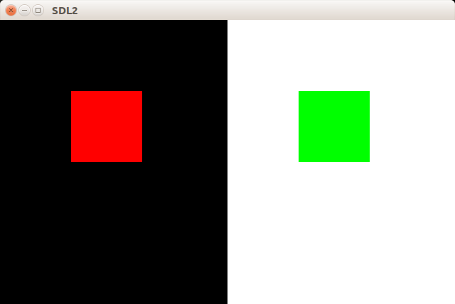

# 创建和使用Texture  
纹理(Texture)可以作为Renderer绘画的目标，用来保存绘制的内容。  

使用[`SDL_CreateTexture`](http://wiki.libsdl.org/SDL_CreateTexture)来创建Texture。  

```C
#include <SDL_render.h>
SDL_Texture* SDL_CreateTexture(SDL_Renderer* renderer, Uint32 format,
                                int access, int w, int h);
//成功返回指针，失败返回NULL
```
* `renderer`参数表示所属的Renderer  
* `format`参数表示像素的[颜色格式](http://wiki.libsdl.org/SDL_PixelFormatEnum)  
* `access`参数表示Texture的[存取方式](http://wiki.libsdl.org/SDL_TextureAccess)
* `w`和`h`是Texture的宽带和高度

使用[`SDL_SetRenderTarget`](http://wiki.libsdl.org/SDL_SetRenderTarget)来设置Renderer的渲染目标，其参数依次为Renderer和Texture的指针，只有创建时`access`设置了`SDL_TEXTUREACCESS_TARGET`的Texture可以作为目标。如果目标为`NULL`，则将目标恢复为Window  

```C
#include <SDL_render.h>
int SDL_SetRenderTarget(SDL_Renderer* renderer, SDL_Texture* texture);
//成功返回0，失败返回负值
```

使用[`SDL_RenderCopy`](http://wiki.libsdl.org/SDL_RenderCopy)可以将一个Texture复制到当前渲染目标上，其参数依次为Renderer指针、Texture指针、Texture的矩形范围、目标的矩形范围(会自动缩放)。后两个参数为NULL时复制整个Texture并填满目标。  

```C
#include <SDL_render.h>
int SDL_RenderCopy(SDL_Renderer* renderer, SDL_Texture* texture,
                    const SDL_Rect* srcrect, const SDL_Rect* dstrect);
//成功返回0，失败返回负值
```

使用[`SDL_DestroyTexture`](http://wiki.libsdl.org/SDL_DestroyTexture)来销毁不需要了的Texture。  

```C
#include <SDL_render.h>
void SDL_DestroyTexture(SDL_Texture* texture);
```

## 一段乱涂乱画的代码  
```C
#include <SDL2/SDL.h>
#include <math.h>
 
int main(int argc,char* argv[])
{
    /* 初始化并创建窗口 */
    SDL_Init(SDL_INIT_EVERYTHING);
    SDL_Window* win = NULL;
    win = SDL_CreateWindow("SDL2",SDL_WINDOWPOS_CENTERED,SDL_WINDOWPOS_CENTERED,
                            640,400,SDL_WINDOW_RESIZABLE);
    /* 创建Renderer */
    SDL_Renderer* render = NULL;
    render = SDL_CreateRenderer(win,-1,SDL_RENDERER_ACCELERATED);
     
     
    /* 创建两个Texture，高度和窗口相同，宽度均为窗口的一半 */
    SDL_Texture* t1 = NULL;
    t1 = SDL_CreateTexture(render,SDL_PIXELFORMAT_RGBA8888,
                             SDL_TEXTUREACCESS_TARGET,320,400);
    SDL_Texture* t2 = NULL;
    t2 = SDL_CreateTexture(render,SDL_PIXELFORMAT_RGBA8888,
                             SDL_TEXTUREACCESS_TARGET,320,400);
                             
    /* 定义一个长方形用来绘画 */
    SDL_Rect r = {100,100,100,100};
    /* 在t1上画一个红色的正方形 */
    SDL_SetRenderTarget(render,t1);
    SDL_RenderClear(render);
    SDL_SetRenderDrawColor(render,0xff,0,0,0);
    SDL_RenderFillRect(render,&r);
    
    /* 在t2上画一个绿色的正方形 */
    SDL_SetRenderDrawColor(render,0xff,0xff,0xff,0);
    SDL_SetRenderTarget(render,t2);//clear为白色
    SDL_RenderClear(render);
    SDL_SetRenderDrawColor(render,0,0xff,0,0);
    SDL_RenderFillRect(render,&r);
    
    /* 恢复为窗口 */
    SDL_SetRenderTarget(render,NULL);
    
    /* 复制t1到窗口左半边 */
    SDL_Rect left = {0,0,320,400};
    SDL_RenderCopy(render,t1,NULL,&left);
    
    /* 复制t2到窗口右半边 */
    SDL_Rect right = {320,0,320,400};
    SDL_RenderCopy(render,t2,NULL,&right);
    /* 显示 */
    SDL_RenderPresent(render);
    
 
    /* 等待退出 */
    SDL_Event e;
    while(1)
    {
        SDL_PollEvent(&e); 
        if(e.type == SDL_QUIT)
        {
            break;
        }
    }
    /* 销毁Texture */
    SDL_DestroyTexture(t1);
    SDL_DestroyTexture(t2);
    /* 销毁renderer */
    SDL_DestroyRenderer(render);
    /* 销毁窗口 */
    SDL_DestroyWindow(win);
    /* 关闭SDL子系统 */
    SDL_Quit();
     
    return 0;
}
```

  