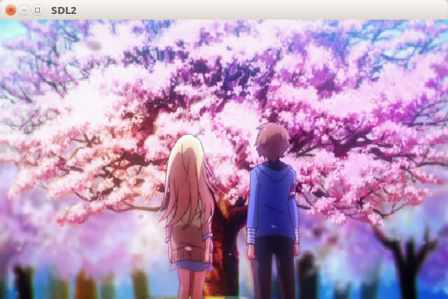

# 加载并使用BMP图片  
SDL2本身仅支持加载位图格式(.bmp)的图片文件，加载其他图片文件需要进行图片解码，可以使用SDL扩展库[SDL_image](https://www.libsdl.org/projects/SDL_image/)。  

加载BMP图片使用[`SDL_LoadBMP`](http://wiki.libsdl.org/SDL_LoadBMP)函数，它的参数的图片文件的路径，返回值是一个表面(Surface)的指针。  

```C
#include <SDL_surface.h>
SDL_Surface* SDL_LoadBMP(const char* file);
//成功返回指针，失败返回NULL
```

使用[`SDL_CreateTextureFromSurface`](http://wiki.libsdl.org/SDL_CreateTextureFromSurface)来将Surface转换成Texture，参数依次为Renderer和Surface。  

```C
#include <SDL_render.h>
SDL_Texture* SDL_CreateTextureFromSurface(SDL_Renderer renderer,
                                            SDL_Surface surface);
//成功返回指针，失败返回NULL
```

使用[`SDL_FreeSurface`](http://wiki.libsdl.org/SDL_FreeSurface)释放一个不再需要的Surface :  
```C
#include <SDL_surface.h>
void SDL_FreeSurface(SDL_Surface* surface);
```

## 显示图片的完整代码
```C
int main(int argc,char* argv[])
{
    /* 初始化并创建窗口 */
    SDL_Init(SDL_INIT_EVERYTHING);
    SDL_Window* win = NULL;
    win = SDL_CreateWindow("SDL2",SDL_WINDOWPOS_CENTERED,SDL_WINDOWPOS_CENTERED,
                            640,400,SDL_WINDOW_RESIZABLE);
    /* 创建Renderer */
    SDL_Renderer* render = NULL;
    render = SDL_CreateRenderer(win,-1,SDL_RENDERER_ACCELERATED);
    /* 清空Render */
    SDL_RenderClear(render);
 
     
    /* 加载BMP图片 */
    SDL_Surface* surface = SDL_LoadBMP("image.bmp");
    /* 通过Surface创建Texture */
    SDL_Texture* texture = SDL_CreateTextureFromSurface(render,surface);
    /* 释放Surface */
    SDL_FreeSurface(surface);
    /* 将Texture复制到Window */
    SDL_RenderCopy(render,texture,NULL,NULL);
    /* 显示Render */
    SDL_RenderPresent(render);
     
 
    /* 等待退出 */
    SDL_Event e;
    while(1)
    {
        SDL_PollEvent(&e); 
        if(e.type == SDL_QUIT)
        {
            break;
        }
    }
    /* 销毁renderer */
    SDL_DestroyRenderer(render);
    /* 销毁窗口 */
    SDL_DestroyWindow(win);
    /* 关闭SDL子系统 */
    SDL_Quit();
     
    return 0;
}
```

  