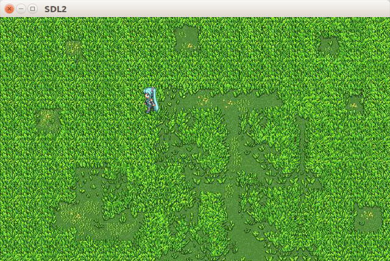

# 键盘事件  
键盘事件采用[`SDL_KeyboardEvent`](http://wiki.libsdl.org/SDL_KeyboardEvent)结构体储存，在[`SDL_Event`](http://wiki.libsdl.org/SDL_Event)中的成员名为`key`。  

|成员类型    |成员名         |说明                                                    |
|:-         |:-             |:-                                                     |
|Uint32     |`type`         |事件类型,按下事件为`SDL_KEYDOWN`，松开事件为`SDL_KEYUP`   |
|Uint32     |`timestamp`    |事件的时间戳                                            |
|Uint32     |`windowID`     |事件产生的窗口ID                                        |
|Uint8      |`state`        |按键的当前状态按下(`SDL_PRESSED`)或松开(`SDL_RELEASED`)  |
|Uint8      |`repeat`       |非0时表示按键长按事件                                    |
|SDL_Keysym |`keysym`       |按键码                                                 |

按键码结构体[`SDL_Keysym`](http://wiki.libsdl.org/SDL_Keysym)里保存了按键的识别编码 :  

|成员类型        |成员名     |说明                |
|:-             |:-         |:-                 |
|SDL_Scancode   |`scancode` |[物理编码](http://wiki.libsdl.org/SDL_Scancode)    |
|SDL_Keycode    |`sym`      |[虚拟编码](http://wiki.libsdl.org/SDL_Keycode)     |
|Uint16         |`mod`      |[修饰按键](http://wiki.libsdl.org/SDL_Keymod)      |

# 一段控制任务移动的完整代码
```C
#include <SDL2/SDL.h>
 
void move(SDL_Keycode direction,SDL_Rect* sel,SDL_Rect* pos);
 
int main(int argc,char* argv[])
{
    /* 初始化并创建窗口 */
    SDL_Init(SDL_INIT_EVERYTHING);
    SDL_Window* win = NULL;
    win = SDL_CreateWindow("SDL2",SDL_WINDOWPOS_CENTERED,SDL_WINDOWPOS_CENTERED,
                            640,400,SDL_WINDOW_RESIZABLE);
     
    /* 创建Renderer和Texture */
    SDL_Renderer* renderer = NULL;
    renderer = SDL_CreateRenderer(win,-1,SDL_RENDERER_ACCELERATED);
    SDL_Surface* mikubmp = SDL_LoadBMP("miku.bmp");
    SDL_Surface* bgbmp = SDL_LoadBMP("blackground.bmp");
    SDL_Texture* miku = SDL_CreateTextureFromSurface(renderer,mikubmp);
    SDL_Texture* bg = SDL_CreateTextureFromSurface(renderer,bgbmp);
    SDL_FreeSurface(mikubmp);
    SDL_FreeSurface(bgbmp);
 
    SDL_Rect selector = {0,0,32,48}; //切割角色图片
    SDL_Rect pos = {0,0,32,48};      //角色的位置
 
    /* 主循环 */
    SDL_Event e;
    while(1)
    {
        /* 清空 */
        SDL_RenderClear(renderer);
        /* 复制背景图片 */
        SDL_RenderCopy(renderer,bg,NULL,NULL);
        /* 复制角色图片 */
        SDL_RenderCopy(renderer,miku,&pos,&selector);
        /* 显示 */
        SDL_RenderPresent(renderer);
         
        if(0 == SDL_PollEvent(&e)) //捕获事件
        {
            continue;  //没有检测到事件，循环继续
        }
        else if(e.type == SDL_QUIT)
        {
            break; //检测到退出事件，退出
        }
        else if(e.type = SDL_KEYDOWN)
        {
            /* 检测到按键事件，移动 */
            move(e.key.keysym.sym,&pos,&selector);
            SDL_Delay(10);
        }
    }
 
    /* 销毁Texture */
    SDL_DestroyTexture(bg);
    SDL_DestroyTexture(miku);
    /* 销毁renderer */
    SDL_DestroyRenderer(renderer);
    /* 销毁窗口 */
    SDL_DestroyWindow(win);
    /* 关闭SDL子系统 */
    SDL_Quit();
     
    return 0;
}
 
 
 
void move(SDL_Keycode direction,SDL_Rect* sel,SDL_Rect* pos)
{
    static int step = 0;
    /* 每次移动2个像素，根据方向切割角色图 */
    switch(direction)
    {
        case SDLK_LEFT  : pos->x -= 2;sel->y=48;break;
        case SDLK_RIGHT : pos->x += 2;sel->y=48*2;break;
        case SDLK_UP    : pos->y -= 2;sel->y=48*3;break;
        case SDLK_DOWN  : pos->y += 2;sel->y=0;break;
        default: return;
    }
    step++;
    if(step >= 5)//每移动5次，切换一块角色图，让角色动起来
    {
        step = 0;
        if(sel->x >= 96)
            sel->x = 0;
        else
            sel->x += 32;
    }
     
}
```

